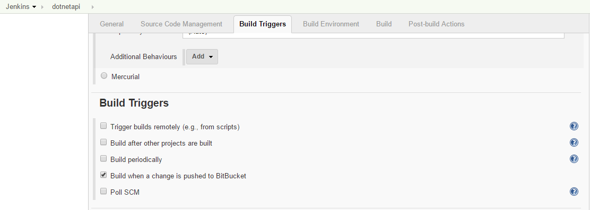
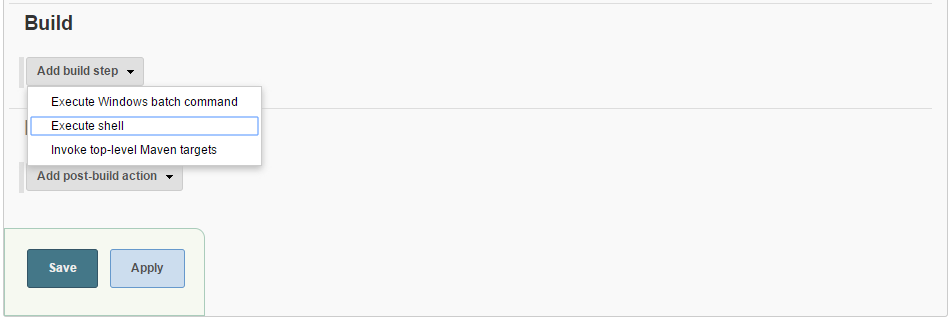
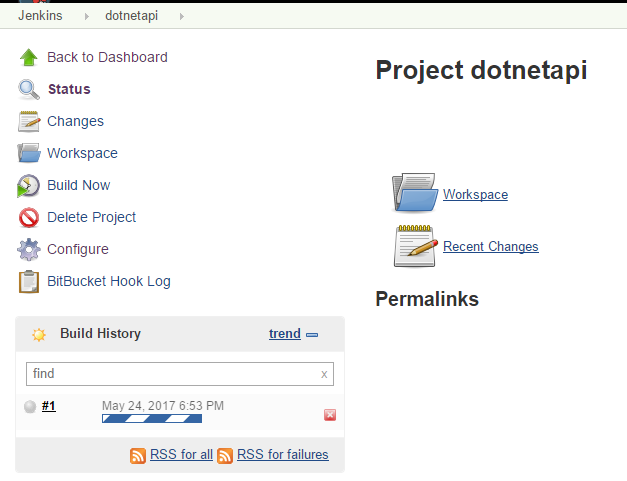
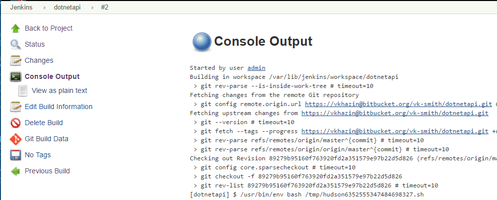

# DotNet Core Jenkins Build Server #

# TL;DR
* Objective was to setup a [CD](https://en.wikipedia.org/wiki/Continuous_delivery) and then [CI](https://en.wikipedia.org/wiki/Continuous_integration) for dotnet core web api running in docker images on [Aws Ecs](http://docs.aws.amazon.com/AmazonECS/latest/developerguide/Welcome.html)
* Proof-of-concept project [dotnet core web api in a docker container](https://bitbucket.org/vk-smith/dotnetapi/src/master/README.md)
* This repo focuses on Jenkins Build Server setup

# Setup on Ubuntu 16.06
* Login into vanilla instance of Ubuntu 16.06
* Clone the repo:
```
git clone https://github.com/vkhazin/dotnetcore-build-jenkins.git
```
* Run commands:
```
chmod +x ./dotnetcore-build-jenkins/*.sh
./dotnetcore-build-jenkins/nginx.sh
./dotnetcore-build-jenkins/docker.sh
./dotnetcore-build-jenkins/aws-cli.sh
./dotnetcore-build-jenkins/dotnetcore.sh
./dotnetcore-build-jenkins/jenkins.sh
```
* After installation login using https://public-ip-address with password listed at the end of setup script
* Psss! Skip the start-up window - you have the required plug-ins installed already!

## Why NginX?
* Jenkins is not as easy to configure to use encryption: https://wiki.jenkins-ci.org/display/JENKINS/Starting+and+Accessing+Jenkins
* NginX reverse proxy is somewhat easier to setup and to encrypt traffic to Jenkins
* See [nginx.sh](https://github.com/vkhazin/dotnetcore-build-jenkins/blob/master/nginx.sh) for details

# Dynamic Dns (optional)
* Should you be interested in EC2 Dynamic Dns integration please see: http://vkhazin.postach.io/post/ddclient-namecheap-com-on-ubuntu-16-06

# Project Setup
* After skipping the setup wizard an empty dashboard is presented:

* Select 'create new jobs' link
* Enter project name and select 'Freestyle Project':

* Select 'Ok' to continue
* On the project configuration page scroll down to 'Source Code Management' and select 'Git' option
* Paste repository url: https://vkhazin@bitbucket.org/vk-smith/dotnetapi.git and configure credentials if applicable

* Under 'Build Triggers' select 'Build when a change is pushed to BitBucket':

* Under 'Build Environment' select 'Use secret text(s) or file(s)' check-box
* Add Aws Credentials binding:

* Supply Aws Access Key Id and Access Key for an account with S3 access, refer to [aws documentation](http://docs.aws.amazon.com/AmazonS3/latest/dev/UsingBucket.html):

* Under 'Build' section select 'Add build step' drop-down and select 'Execute shell':

* In the script text-area paste following commands:
```
#!/usr/bin/env bash
chmod +x ./ci-build.sh
./ci-build.sh
```

* Select 'Save' button and you should be redirected to project dashboard
* On the left hand select 'Build Now' link to trigger a new build
* A build progress indicator should appear:

* Select the build number and then select 'Console Output' on the left hand:

* If all is in order the last few lines should look like:
```
Successfully built 2077316da135
{
    "ETag": "\"063040707e031856e76c3fc7537c1d0a\""
}
Finished: SUCCESS
```
