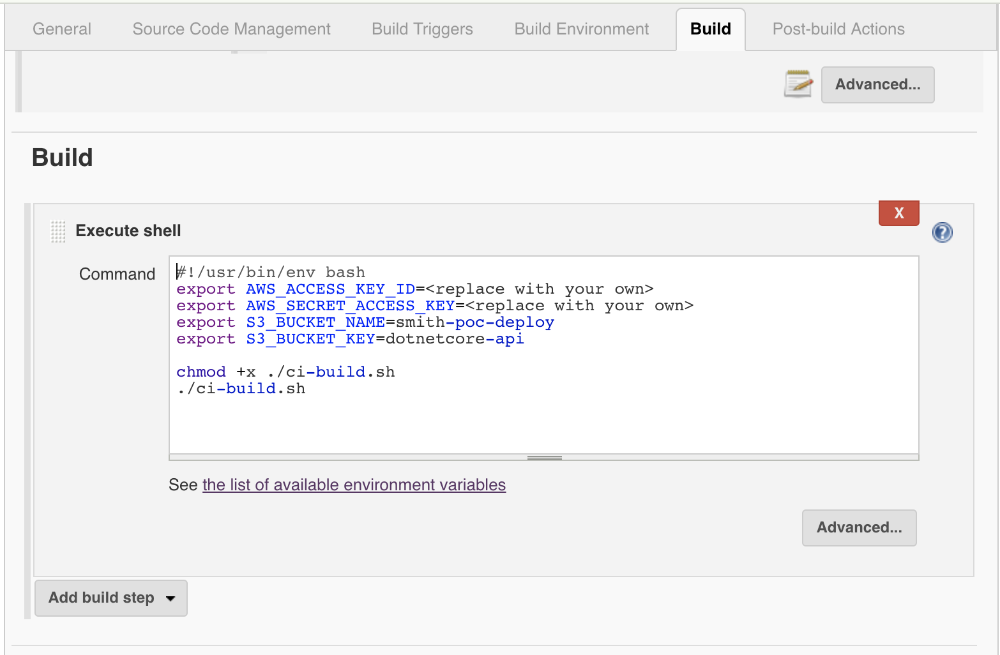

# Jenkins + Container Setup on Ubuntu 16.04
* Login into vanilla instance of Ubuntu 16.04
* Clone the repo:
```
git clone https://github.com/vkhazin/dotnetcore-build-jenkins.git
```
* Run commands:

```
sudo apt update && \
chmod +x ./dotnetcore-build-jenkins/*.sh && \
./dotnetcore-build-jenkins/nginx.sh && \
./dotnetcore-build-jenkins/docker.sh && \
./dotnetcore-build-jenkins/aws-cli.sh && \
./dotnetcore-build-jenkins/dotnetcore.sh && \
./dotnetcore-build-jenkins/jenkins.sh
```
* After installation login using https://public-ip-address with password listed at the end of setup script
* Psss! Skip the start-up window - you have the required plug-ins installed already!

## Why NginX?
* Jenkins is not as easy to configure to use encryption: https://wiki.jenkins-ci.org/display/JENKINS/Starting+and+Accessing+Jenkins
* NginX reverse proxy is somewhat easier to setup and to encrypt traffic to Jenkins
* See [nginx.sh](https://github.com/vkhazin/dotnetcore-build-jenkins/blob/master/nginx.sh) for details

# Dynamic Dns (optional)
* Should you be interested in EC2 Dynamic Dns integration please see: http://vkhazin.postach.io/post/ddclient-namecheap-com-on-ubuntu-16-06

# Project Setup
* After skipping the setup wizard an empty dashboard is presented:

* Select 'create new jobs' link
* Enter project name and select 'Freestyle Project':

* Select 'Ok' to continue
* On the project configuration page scroll down to 'Source Code Management' and select 'Git' option
* Paste repository url: https://vkhazin@bitbucket.org/vk-smith/dotnetcore-api.git and configure credentials if applicable

* Under 'Build Triggers' select 'Build when a change is pushed to BitBucket':

* Under 'Build Environment'
   * Select 'Build inside a Docker container'
   * Under 'Docker image to use' select 'Pull docker image from repository' and provide image tag: vkhazin/dotnetcore-build:1.1.2
   * User group: 'docker'
   * Container start command: 'wrapdocker /bin/cat', that to keep container running

* Under 'Build' section select 'Add build step' drop-down and select 'Execute shell':

* In the script text-area paste following commands:
```
#!/usr/bin/env bash
export AWS_ACCESS_KEY_ID=<replace with your id>
export AWS_SECRET_ACCESS_KEY=<replace with your secret>

chmod +x ./ci-build.sh
./ci-build.sh
```

* Select 'Save' button and you should be redirected to project dashboard
* On the left hand select 'Build Now' link to trigger a new build
* A build progress indicator should appear:

* Select the build number and then select 'Console Output' on the left hand:

* If all is in order the last few lines should look like:
```
Successfully built 2077316da135
{
    "ETag": "\"063040707e031856e76c3fc7537c1d0a\""
}
Finished: SUCCESS
```
* To configure Bibucket webhook for building on every commit log-in to bitbucket
* Open the repository Settings->Webhooks and add new web hook with following url:
https://ip or dns entry/bitbucket-hook/
* Check 'Skip certificate verification' check-box as we are using a self-signed cert

* If all is in order any following commit to Bitbucket will trigger an automated build using Jenkins

# Happy CD/CI!
